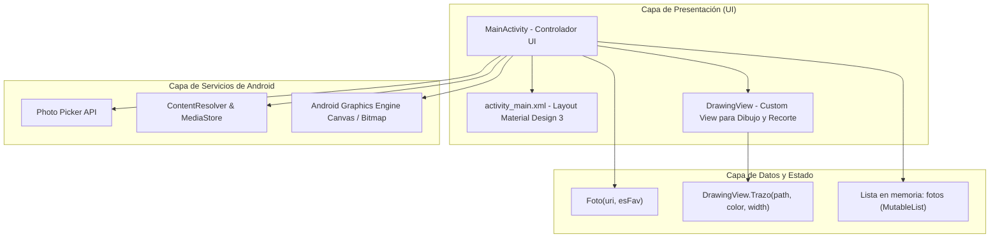

# Proyecto_1_Dep_Galeria_Kotlin - Galería y Editor Multimedia Android (Kotlin Nativo)

Aplicación móvil nativa desarrollada para el sistema operativo Android en **Kotlin**, que permite la visualización, organización y edición multimedia avanzada de imágenes digitales mediante un visor interactivo, gestión de favoritos y un motor de edición integrado.

---

## 1. Nombre del Proyecto
**Proyecto_1_Dep_Galeria_Kotlin** (Galería Interactiva y Editor Multimedia en Android Nativo - Kotlin)

---

## 2. Objetivo General
Diseñar e implementar una aplicación móvil nativa en Android utilizando el lenguaje **Kotlin**, que ofrezca al usuario una solución integral para la gestión y manipulación de fotografías digitales almacenadas en el dispositivo, incorporando funciones de navegación dinámica, filtrado por favoritos, herramientas de edición visual (dibujo a mano alzada con paleta cromática, recorte interactivo por cuadrante y rotación matricial) y almacenamiento persistente en el dispositivo a través de la API `MediaStore`.

---

## 3. Descripción Funcional del Sistema
El sistema proporciona una experiencia de usuario fluida y reactiva distribuida en dos modos principales de interacción:

### A. Modo Galería (Navegación y Administración)
- **Selección e Importación de Fotos:** Utiliza el contrato moderno `ActivityResultContracts.PickMultipleVisualMedia` (Android Photo Picker), permitiendo al usuario seleccionar una o varias imágenes de su dispositivo de forma segura y sin requerir permisos invasivos de almacenamiento global en versiones recientes.
- **Navegación Intuitiva:** Visor fotográfico central basado en `MaterialCardView` e `ImageView` (`fitCenter`), complementado con botones flotantes circulares para navegar hacia adelante y hacia atrás entre las fotos cargadas.
- **Sistema de Favoritos y Filtros:** Cada fotografía puede ser marcada o desmarcada como favorita en tiempo real. Un ícono flotante sobre la tarjeta y un botón en el panel inferior reflejan el estado del elemento. La barra de herramientas superior (`MaterialToolbar`) incluye un botón de filtro que conmuta la visualización entre el catálogo completo y exclusivamente las imágenes favoritas.
- **Eliminación Dinámica:** Permite remover la imagen actualmente en pantalla de la lista en memoria, recalculando y sincronizando el índice de visualización de manera automática.

### B. Modo Edición Multimedia
Al presionar el botón "Editar", la interfaz realiza una transición fluida al panel de herramientas de edición:
- **Pincel y Dibujo Libre (`DrawingView`):** Permite dibujar trazos continuos directamente sobre la imagen utilizando el dedo o puntero táctil, ofreciendo una paleta de 6 colores predefinidos (rojo, azul, verde, amarillo, negro y blanco).
- **Deshacer Trazos (`Undo`):** Permite revertir de forma secuencial los últimos trazos realizados en el lienzo sin perder el trabajo previo.
- **Herramienta de Recorte Interactivo (`Crop Tool`):** Despliega una capa translúcida oscurecida con marco delimitador y 4 anclas táctiles manipulables para ajustar dimensiones y proporciones de recorte, así como traslación completa del área seleccionada.
- **Rotación Matricial:** Permite rotar la imagen en incrementos de 90° en sentido horario (`postRotate(90f)`) adaptando el lienzo en tiempo real.
- **Guardado y Exportación en Alta Calidad:** Comprime y fusiona el bitmap original con los trazos vectoriales en un archivo JPEG con 95% de compresión y lo almacena en la ruta de almacenamiento público `Pictures/MiGaleria` mediante `MediaStore`.

---

## 4. Módulos Desarrollados

### 1. Módulo Principal y Controlador de Navegación (`MainActivity.kt`)
- Administra el ciclo de vida de la aplicación, inicialización de vistas y asignación de eventos (Listeners).
- Controla las colecciones en memoria (`fotos: MutableList<Foto>`), el puntero de posición (`indice`) y el estado del filtro (`soloFav`).
- Coordina la alternancia entre el modo visualización y el modo edición, controlando la visibilidad de componentes.

### 2. Módulo de Lienzo y Renderizado Táctil (`DrawingView`)
- Clase personalizada que extiende de `android.view.View`.
- Implementa `onTouchEvent` para la captura de coordenadas de movimiento, optimizada con interpolación cuadrática (`Path.quadTo`) para obtener trazos vectoriales suaves.
- Mantiene la pila de objetos `Trazo(val path: Path, val color: Int, val width: Float)`.
- Gestiona la visualización del visor de recorte (`cropRect`), los manejadores de esquina (`handles`) y el enmascarado oscuro exterior.

### 3. Módulo de Transformación de Imágenes y Algoritmos Gráficos
- **Mapeo de Escala de Pantalla a Bitmap:** Algoritmo que calcula el factor de escala uniforme `s = minOf(viewWidth / bitmapWidth, viewHeight / bitmapHeight)` y los márgenes de centrado (`dx`, `dy`) generados por el modo de ajuste `fitCenter`.
- **Motor de Recorte Matricial:** Conversión bidireccional de coordenadas de pantalla a coordenadas reales de píxeles del mapa de bits para extraer sub-bitmaps (`Bitmap.createBitmap(b, x, y, bw, bh)`).
- **Rotación Matricial:** Aplicación de transformaciones geométricas afines mediante `android.graphics.Matrix`.

### 4. Módulo de Almacenamiento y Persistencia (`MediaStore Engine`)
- Manejo de metadatos de medios (`ContentValues`, `MIME_TYPE`, `DISPLAY_NAME`, `RELATIVE_PATH`).
- Integración con `ContentResolver` para escribir flujos binarios de salida (`openOutputStream`) sin violar las directivas de Scoped Storage.

### 5. Módulo de Interfaz de Usuario y Recursos (`XML Layouts & Drawables`)
- **Diseño Responsivo:** Implementado en `activity_main.xml` con `ConstraintLayout` y componentes de Material Design 3 (`MaterialToolbar`, `MaterialCardView`, `MaterialButton`).
- **Recursos Gráficos Vectoriales:** Íconos de favoritos (`ic_heart_filled`, `ic_heart_outline`), fondos circulares con estados y paleta de colores en `colors.xml`.

---

## 5. Tecnologías Empleadas

| Categoría | Tecnología / Herramienta | Descripción / Versión |
| :--- | :--- | :--- |
| **Lenguaje de Programación** | Kotlin | Lenguaje moderno para desarrollo nativo Android |
| **Plataforma Objetivo** | Android SDK | Min SDK: 23 (Android 6.0 Marshmallow) Target & Compile SDK: 37 |
| **Entorno de Desarrollo (IDE)**| Android Studio | IDE oficial con emuladores y analizador de APK |
| **Sistema de Compilación** | Gradle (Kotlin DSL) | Configuración moderna con `build.gradle.kts` y catálogo de versiones |
| **Librerías UI / UX** | Material Components (M3) | `com.google.android.material:material` |
| **Componentes de Arquitectura** | AndroidX Core KTX / AppCompat | Extensiones idiomáticas de Kotlin para APIs de Android |
| **Contratos de Actividad** | ActivityResultContracts | `PickMultipleVisualMedia`, `RequestMultiplePermissions` |
| **Motor Gráfico 2D** | Android Graphics Library | `android.graphics.Canvas`, `Paint`, `Path`, `Bitmap`, `Matrix`, `RectF` |
| **Gestor de Almacenamiento** | Android MediaStore API | Acceso conforme a Scoped Storage (`MediaStore.Images.Media`) |
| **Control de Versiones** | Git & GitHub | Control de versiones distribuido |

---

## 6. Explicación de la Arquitectura General
El proyecto sigue una arquitectura **Model-View-Controller (MVC) / Single Activity Architecture** adaptada a las directrices de Android:

- **Separación de Responsabilidades:**
  - **Estado y Modelo:** Representado por la clase de datos `Foto`, que encapsula la URI del recurso multimedia y su bandera booleana `esFav`.
  - **Vista Personalizada (`DrawingView`):** Aísla por completo la complejidad del procesamiento de eventos táctiles, la geometría de recorte y la acumulación de trazos vectoriales, evitando saturar la actividad principal.
  - **Controlador (`MainActivity`):** Actúa como orquestador, escuchando eventos de usuario, alternando paneles según el estado de la aplicación y coordinando la persistencia.
  - **Transformación Aislada:** La edición no altera la imagen original en el almacenamiento hasta que el usuario confirma la acción mediante el botón "Guardar", momento en el cual se genera un nuevo archivo derivado sin pérdida de la fuente original.

